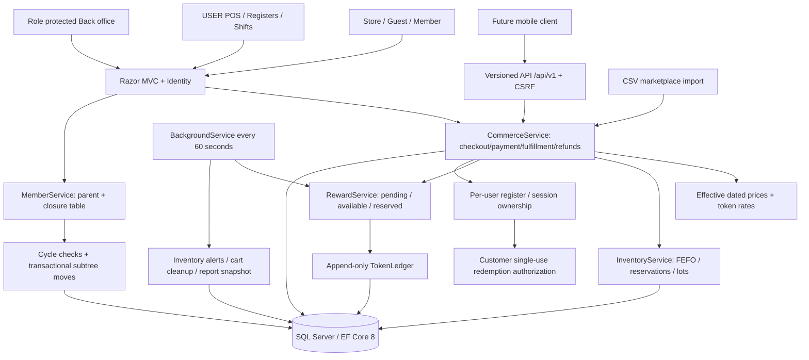

# Architecture

## Transaction boundaries

Checkout runs at Serializable isolation and saves order, pricing/token snapshots, FEFO reservations, token reservations, promotion usage, payment intent and POS settlement atomically. Token balance is computed from immutable delta entries; all mutation paths use database transactions and unique business event keys. SQL Server rowversion protects stock/member/price/session records. Deadlocks roll back the losing transaction; the client can retry with the same idempotency key.

Payment confirmation converts inventory reservations to sales, and Reserved Token to Redeemed, in one transaction. Verified retail completion changes status and snapshots the first three ancestors into distributions in one transaction. Sponsor moves subsequently change the closure table, never old distribution recipients.

A partial return uses cumulative rounded proportions, subtracts already reversed amounts, returns sellable stock to the original lots, restores purchase redemption, and adds compensating reward entries for the original recipients. Used rewards can create a negative Available balance. Expired rewards are not debited twice. FIFO token consumption tracks reservations/redemptions so expiry affects unspent portions only.

## POS access

One PosRegister per Identity user; one open PosSession per register, enforced by a filtered unique index. Server queries scope sessions and sales to the authenticated cashier. Admin settings can assign each register to a warehouse or disable it. All stock remains central per warehouse; there is no client-supplied stock balance, price, cashier identity, or payment total.

POS redemption requires the customer to create a 5-minute authorization for a specific register and maximum amount from their authenticated account. Checkout validates and consumes the hashed authorization in the same Serializable transaction as the ledger reservation. A cashier cannot debit another member using only a member code.

Cash payment settles immediately; bank transfer remains PendingPayment until Finance confirms. POS cash sales become Delivered, but they do not issue network rewards until Finance/Admin verifies the retail evidence. Returns are processed by Finance outside the cash drawer; a close records opening cash + confirmed cash sales, counted cash and variance.

## Storage conventions

Business keys use bigint identities, with GUID order/cart/referral public IDs. Identity retains its standard string keys. Timestamps use UTC datetime2. Monetary/token columns use decimal(18,2). Foreign keys use Restrict. Ledger/audit/inventory transactions have SQL UPDATE/DELETE blockers and EF guards. Do not grant the runtime database account schema-alter permissions.

The web app is one deployable project with Domain, Data, Services, Controllers and Razor Views separated by concern. Interfaces cover payments, marketplace sync/import, shipping, email/LINE and recurring jobs. This permits extracting workers or replacing BackgroundService with Hangfire without changing transaction services.

## Warehouse ownership and reporting

Warehouse.Kind distinguishes Company, Dealer, and Member. A SQL check constraint requires a member owner for private warehouses and no owner for company warehouses. New registration creates a private warehouse and POS register atomically. Existing warehouse/register assignments remain unchanged. POS administrators may assign a company warehouse or the cashier's own warehouse, only after closing the shift.

`StockController.Visible` is the common scope for report rows, warehouse selectors and CSV exports. Only the warehouse owner (active member), or inventory/report staff, can see stock. Members never receive cost columns in rendered reports or CSV. Low-stock and expiry notifications are scoped to warehouse owners. On-hand includes reserved and unavailable stock; sellable excludes expired lots, closed warehouses and reservations. Reports include stocked SKU/warehouse combinations, including zero-balance lots, rather than generating all possible SKU/warehouse pairs.

## Stock replenishment

`StockTransfer` progresses Requested → Dispatched → Received (or Requested → Cancelled). Requested does not reserve inventory. Dispatch is a Warehouse-policy action using a Serializable transaction and FEFO from unreserved, unexpired batches. Immutable TransferOut movements and allocation rows preserve origin lots; the document represents in-transit units until receipt. Receipt is authorized to the destination owner or inventory staff, copies original lot metadata, and appends TransferIn movements atomically. The source and destination physical balances plus in-transit units are conserved. Request GUID uniqueness and terminal-state checks make repeated submissions idempotent; rowversion and transaction locking prevent concurrent overdraw. No commerce/payment/reward service is invoked by transfers.

## Media, content, conversations and sales subledger

MediaAssets store original raster bytes in SQL varbinary(max), with fixed MIME types, a 5 MB limit and a unique product/slot index (four gallery slots plus one description slot). ContentPost publication windows are evaluated in UTC after converting Bangkok form input; the same audience/time predicate guards image access. Brand images are public, while draft and member-only campaign assets require appropriate access. Razor encodes all announcement and conversation text.

ConversationService scopes every thread to its owner or CustomerService/Admin/SuperAdmin. UUID message keys prevent replay, explicit CSRF-protected read acknowledgements record read times, and the authenticated navigation polls unread counts every 30 seconds.

AccountingService posts immutable, balanced sales/refund journal entries inside the existing commerce transaction. Unique event keys avoid duplicate postings. Inventory return operations return the actual restored inventory cost, independent of intermediate SaveChanges in the reward services. Journal records cannot be updated/deleted through EF or SQL; new lines cannot be appended to posted journals through EF. This is a management sales subledger, not a statutory general ledger or tax invoice system.
